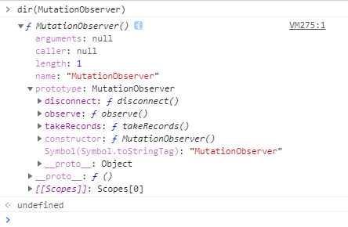
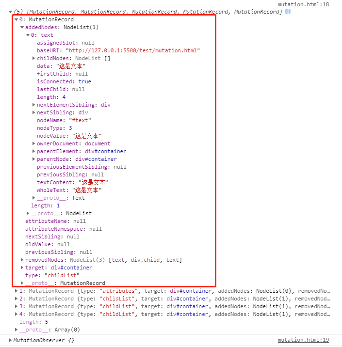

:::info 方法介绍
`MutationObserver` 用来监视 DOM 变动。DOM 的任何变动，比如节点的增减、属性的变动、文本内容的变动都会触发 `MutationObserver` 事件。
但是，它与事件有一个本质不同：事件是同步触发，也就是说，DOM 的变动立刻会触发相应的事件；
`Mutation Observer` 则是异步触发，DOM 的变动并不会马上触发，而是要等到当前所有 DOM 操作都结束才触发。

`Mutation Observer` 有以下特点：

它等待所有脚本任务完成后，才会运行（即异步触发方式）。
它把 DOM 变动记录封装成一个数组进行处理，而不是一条条个别处理 DOM 变动。
它既可以观察 DOM 的所有类型变动，也可以指定只观察某一类变动。
:::

## 1.observe

> 对一个节点添加观察器，就像使用 addEventListener 方法一样，多次添加同一个观察器是无效的，回调函数依然只会触发一次。但是，如果指定不同的 options 对象，就会被当作两个不同的观察器。

> observe(target, config)：
>
> > target：需要监听的元素 [element]
>
> > config：需要监听的属性 [Object]
> >
> > > - childList：子节点的变动（指新增，删除或者更改）。
>
> > > - attributes：属性的变动。
>
> > > - characterData：节点内容或节点文本的变动。
>
> > > - subtree：布尔值，表示是否将该观察器应用于该节点的所有后代节点。
>
> > > - attributeOldValue：布尔值，表示观察 attributes 变动时，是否需要记录变动前的属性值。
>
> > > - characterDataOldValue：布尔值，表示观察 characterData 变动时，是否需要记录变动前的值。
>
> > > - attributeFilter：数组，表示需要观察的特定属性（比如[‘class’,‘src’]）。

```js
// 开始监听文档根节点（即<html>标签）的变动
mutationObserver.observe(document.documentElement, {
  attributes: true,
  characterData: true,
  childList: true,
  subtree: true,
  attributeOldValue: true,
  characterDataOldValue: true,
});
```

## 2.disconnect()

disconnect 方法用来停止观察。调用该方法后，DOM 再发生变动，也不会触发观察器。

## 3.takeRecords()

用来清除变动记录，即不再处理未处理的变动。该方法返回变动记录的数组。

## 4.MutationRecord 

含义:返回的变动记录

DOM 每次发生变化，就会生成一条变动记录（MutationRecord 实例）。该实例包含了与变动相关的所有信息。

Mutation Observer 处理的就是一个个 MutationRecord 实例所组成的数组。

MutationRecord 对象包含了 DOM 的相关信息，有如下属性:

> type：观察的变动类型（attribute、characterData 或者 childList）。

> target：发生变动的 DOM 节点。

> addedNodes：新增的 DOM 节点。

> removedNodes：删除的 DOM 节点。

> previousSibling：前一个同级节点，如果没有则返回 null。

> nextSibling：下一个同级节点，如果没有则返回 null。

> attributeName：发生变动的属性。如果设置了 attributeFilter，则只返回预先指定的属性。

> oldValue：变动前的值。这个属性只对 attribute 和 characterData 变动有效，如果发生 childList 变动，则返回 null。

### 4.1 示例 1

```html
<div id="container">
  <div class="child"></div>
</div>
<button id="update">改变</button>
<script>
  let MutationObserver =
    window.MutationObserver ||
    window.WebKitMutationObserver ||
    window.MozMutationObserver;
  const container = document.getElementById("container");
  const button = document.getElementById("update");
  const options = {
    attributes: true,
    childList: true,
  };
  // 创建MutationObserver实例，返回一个观察者对象
  const mutation = new MutationObserver(function (mutationRecoards, observer) {
    console.log(mutationRecoards);
    console.log(observer);
  });
  // 对观察者添加需要观察的元素，并设置需要观察元素的哪些方面
  mutation.observe(container, options);

  // 对container进行操作
  button.addEventListener("click", function () {
    container.innerText = "这是文本"; // 内容改变
    container.style.background = "red"; // 属性改变
    for (let i = 0; i < 3; i++) {
      // 子节点
      container.appendChild(document.createElement("div"));
    }
  });
</script>
```



### 4.2 示例 2

```js
useEffect(() => {
    // 选择需要观察变动的节点
    const targetNode = document.getElementsByClassName(
      "fc-view-harness fc-view-harness-active"
    )[0];

    // 观察器的配置（需要观察什么变动）
    const config = { childList: true };

    // 当观察到变动时执行的回调函数
    const callback = function (mutationsList: any, observer: any) {
      // Use traditional 'for loops' for IE 11
      for (let mutation of mutationsList) {
        if (mutation.type === "childList") {
          const addEle = mutation.addedNodes[0] as HTMLElement;
          if (addEle && addEle.classList.contains("fc-popover")) {
            const date = addEle.getAttribute("data-date");
            const parentEle = document.querySelector(
              `td[data-date="${date}"]`
            ) as HTMLElement;
            addEle.style.top = "0";
            addEle.style.left = "0";
            parentEle.style.position = "relative";
            parentEle?.appendChild(addEle);
          }
        }
      }
    };

    // 创建一个观察器实例并传入回调函数
    const observer = new MutationObserver(callback);

    // 以上述配置开始观察目标节点
    observer.observe(targetNode, config);

    return () => {
      // 之后，可停止观察
      observer.disconnect();
    };
  }, []);

```

## 5.拓展

### 1）`ResizeObserver` : `mutatObserver`的封装

有一定兼容性(谷歌 64+，但是浏览器支持不是很好)，可以安装:

```js
npm i resize-observer-polyfill
```

```js
import ResizeObserver from "resize-observer-polyfill";

const ro = new ResizeObserver((entries, observer) => {
  for (const entry of entries) {
    console.log("被监听元素content的宽高及位置", entry.contentRect);
    // bottom: 700 指top + height的值
    // height: 600 指元素本身的高度，不包含padding，border值
    // left: 100 指padding-left的值
    // right: 1143 指left + width的值
    // top: 100 指padidng-top的值
    // width: 1043  指元素本身的宽度，不包含padding，border值
    // x: 100
    // y: 100
    console.log("被监听元素的宽高", entry.borderBoxSize);
    // blockSize: 1000
    // inlineSize: 1443
    console.log("被监听元素content部分的宽高", entry.contentBoxSize);
    // blockSize: 600
    // inlineSize: 1043
    console.log("被监听元素", entry.target);
  }
});

ro.observe(document.body);
```

:::info 基本介绍
`ResizeObserver.disconnect()`
取消和结束目标对象上所有对 Element 或 SVGElement 观察。

`ResizeObserver.observe()`
开始观察指定的 Element 或 SVGElement。

`ResizeObserver.unobserve()`
结束观察指定的 Element 或 SVGElement。
:::
:::info 语法

```js
const resizeObserver = new ResizeObserver((entries) => {
  for (let entry of entries) {
    // 做一些事情
  }
});
```

:::
:::note 节流优化

```js
const throttle = （fun,delay） => {
	let timer = null;
	return function() {
		const args = arguments
		if(!timer) {
			timer = setTimeout(() => {
				timer = null
			}, delay)
			fun(args )
		}
	}
}

const myObserver = new ResizeObserver(throttle(entries => {
  entries.forEach(entry => {
    console.log('大小位置 contentRect', entry.contentRect)
    console.log('监听的DOM target', entry.target)
  })
}), 500)

myObserver.observe(document.body)

```

:::
