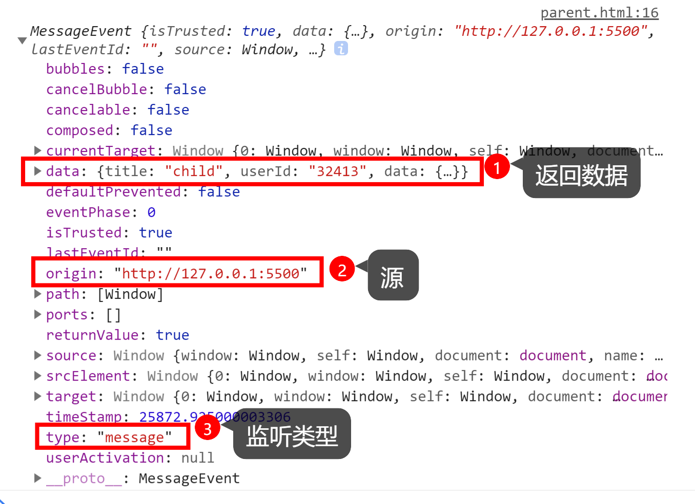

// import { envUrl } from "/src/utils/env";
// const iframe1 = envUrl() + "/html/postMessage/parent.html";
// const iframe2 = envUrl() + "/html/postMessage2/parent.html";

> 监听的'message'类型的事件

## 1.网页内嵌/同源

      见测试页面

## 2.跨源

      见测试页面
