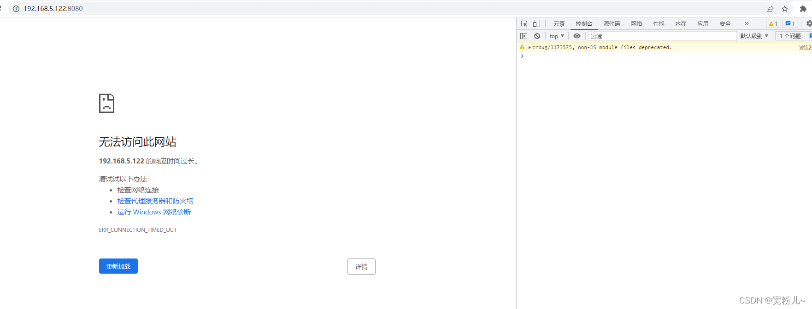
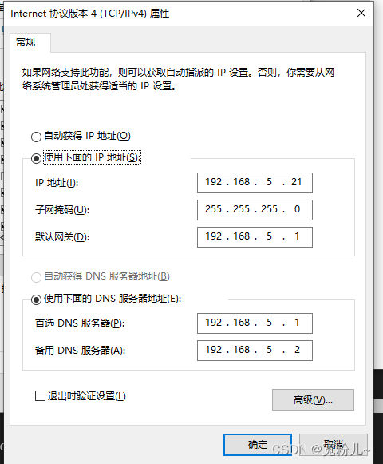
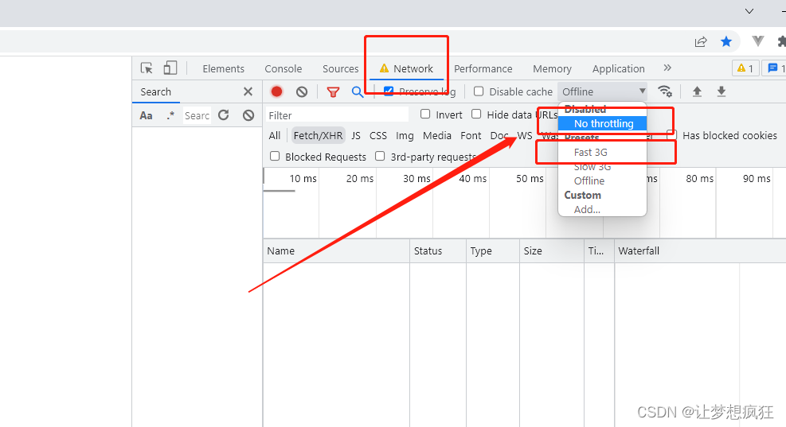

# crbug/1173575, non-JS module files deprecated.

:::danger
项目正常本地构建，但是浏览器报错如图
:::


## 问题原因

1. `webpack` 中的 `devServer` 开启了 `https` ，但是本地构建打开浏览器用的是 `http`

> 此时: `http://localhost:3000` 会报错，需变成 `https`

```js
// 开发环境配置
const devConfig = {
  devtool: "source-map",
  devServer: {
    host: "0.0.0.0",
    port: 3000,
    open: true,
    disableHostCheck: true,
    https: true, //这个地方配置了，就必须https访问,如果不必要，注释掉
    // 开发配置代理文件
    proxy: require("./dev.config.js"),
  },
};
```

2. 电脑`ip`地址设置了动态`ip`，项目`ip`地址本来是`192.168.5.122`，可能构建会变成变成了`192.168.5.12`

> 这种情况可能需要把电脑`ip`改成静态的



3. 打开`F12`开发者工具操作时可能会出现该问题。原因是谷歌浏览器在控制台网络设置问题，将 Offline（离线）改为 No throttling/Fast 3G，再次刷新页面即可解决问题。


