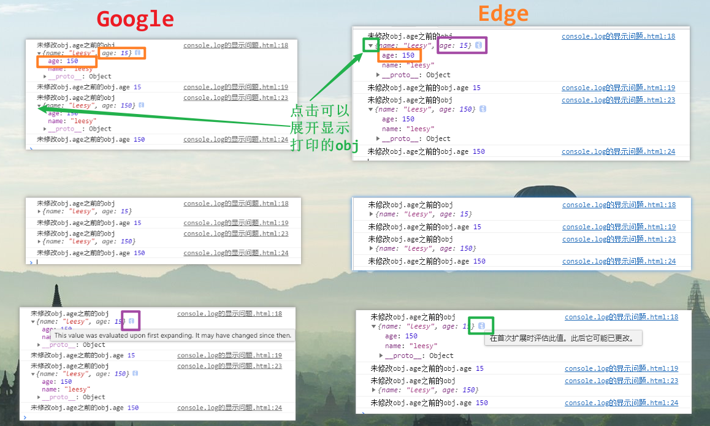

:::info 描述
console.log 打印对象时会出现预览与展开内容不一致的情况
:::

## 问题描述

> 当我们执行下述代码时：

```js
<script>

    let obj = {
        name: 'leesy',
        age: 15
    }

    console.log('未修改obj.age之前的obj',obj);
    console.log('未修改obj.age之前的obj.age',obj.age);

    obj.age = 150;

    console.log('未修改obj.age之前的obj',obj);
    console.log('未修改obj.age之前的obj.age',obj.age);

</script>
```



## 原因

不展开预览与展开对象`获取的数据的时间点`不一样。

不展开，控制台默认显示当时对象 obj 的快照，是 `console.log` 代码执行时的对象快照；不是当前内存（堆内存）中 `obj.age` 的真实值；

展开，控制台不会显示 obj 的快照，而是会重新去内存中取 `obj.age` 的真实值。

对于 `Object` 等引用类型来说，都可能会出现上述异常打印输出。

## 解决方法

1. 改为 `console.log(JSON.stringfy(obj))`，进行输出;
2. 通过打断点的方式去看;
3. `console.dir()`;
